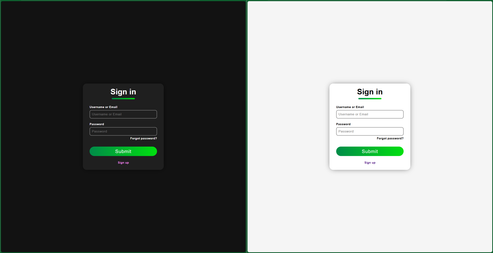
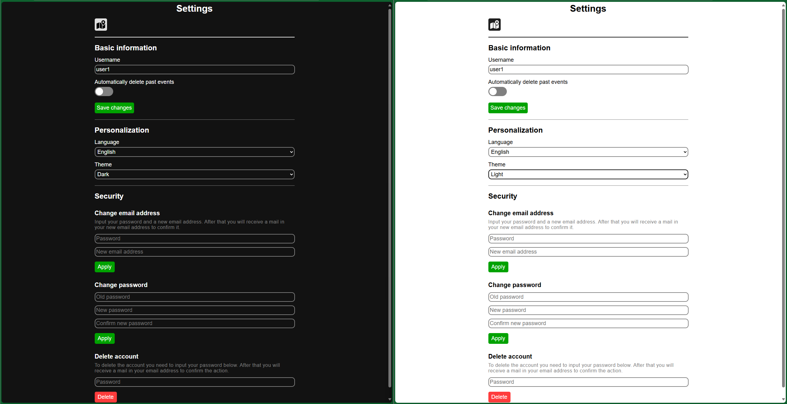

# Event Cartographer

## Table of Contents
- [About](#about)
- [Features](#features)
- [Technologies Used](#technologies-used)
- [Usage](#usage)
- [License](#license)
- [Screenshots](#screenshots)

## About

**Event Cartographer** is a website designed to for users to mark their events on an interactive map with markers that can contain such info as title, description, coordinates (latitude and longitude), time when the event starts and the importance level that has 3 variations (low, medium, and high). The service also includes a function that allows to delete the existing markers that have past events automatically.

## Features

- Registration that contains of entering the necessary information (username, email address and password) witch is followed by confirmation via email, and after that the user can sign into the service;
- Managing the list of markers on the map, which includes adding, editing and deleting.
- Searching, sorting, and filtering marker list in the special right-side panel that also allows to navigate to the selected markers;
- Ability to allow the service to automatically remove markers that represent past events;
- User settings that allow a user to edit basic info, theme, language, email address, password, and delete the user's account;
- Ability to switch between light and dark themes;
- Localization support for three languages:
  - English;
  - Russian;
  - Ukrainian.

## Technologies Used

- Platform: [.NET 8](https://learn.microsoft.com/en-us/dotnet/core/whats-new/dotnet-8/overview);
- Server framework: [ASP.NET Core](https://learn.microsoft.com/en-us/aspnet/core/introduction-to-aspnet-core?view=aspnetcore-8.0);
- ORM: [Entity Framework Core 8](https://learn.microsoft.com/en-us/ef/core/);
- Database: [Microsoft SQL Server](https://www.microsoft.com/en-us/sql-server/sql-server-downloads?ocid=ORSEARCH_Bing&msockid=26c4c807566060851983dcd257726152);
- Web client framework: [React JS 18](https://react.dev/);
- Interactive map library: [Leaflet](https://leafletjs.com/);
- Translation: [i18next](https://www.i18next.com/).

## Usage

1. Install **Microsoft Visual Studio** (2022 version recommended) with all plugins necessary for working with ASP.NET projects.
2. Install **Node JS**.
3. Open the project in **Microsoft Visual Studio**.
4. Open [EventCartographer.Server/appsettings.json](EventCartographer.Server/appsettings.json) file then add an email address and a password for the email address account to the required fields. This data will be used for the email service to send messages to the users.
5. If you want to change the web client host from `localhost`, you need to change `WebClientHost` constant in [EventCartographer.Server/Constants.cs](EventCartographer.Server/Constants.cs).
6. Run the project.
7. Enter the website.

## License

[MIT License](LICENSE)

## Screenshots

